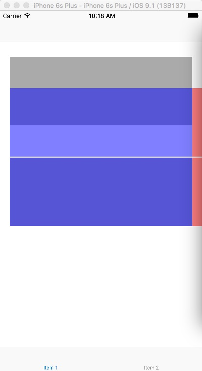

# Autolayout和UIscrollView实践
#####一直在用Masonry，最近看了[里脊串关于Autolayout和UIScrollView的文章](http://adad184.com/2015/12/01/scrollview-under-autolayout/)，也看了[土土哥关于Masonry的文章](http://tutuge.me/2015/12/14/autolayout-example-with-masonry3/)。自己也来提高一把。我想要得效果是在ViewController里面的一个`UIView`里面手动添加`UIScrollView`，`UIscrollView`只左右滑动。现在遇到的问题是：

* 1.如果这个`UIView`是用代码手动创建的，`UIScrollView`里面的内容就没有问题。 如果这个`UIView`是从storyboard里面拉出来的，`UIScrollView`的内容就会不对,里面的内容会上下滚动。如下图：上面是从storyboard里面拉出来的，下面是用代码手动创建的

* 2.另外一个奇怪的问题：如果在storyboard里面把tabbarcontrol设为`initial View controller`，再把appdelegate里面添加rootVC的代码注释了。那么不管从storyboard里面拉，还是代码创建UIView都没有问题。 是不是跟appdelegate里面代码添加rootVC有关系？

代码地址：[Demo](https://github.com/funpig/DemoAutolayoutUIScrollView)

-

###更新：（问题解决，又有新的疑惑）
经过试验发现，如果把`UIScrollView`加入`UIView`的时机放在`viewDidLoad`之后，例如`viewWillAppear`或`viewDidAppear`都不会出现问题。但为什么还没想明白？谨慎的猜测Autolayout在`viewDidLoad`的时候有问题？哪为什么代码添加的`UIView`又没有问题？

